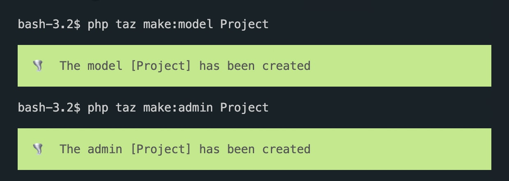

# 🦅 Taz CLI for Silverstripe

[](https://packagist.org/packages/goldfinch/taz)
[](https://packagist.org/packages/goldfinch/taz)
[](https://packagist.org/packages/goldfinch/taz)
[](https://packagist.org/packages/goldfinch/taz) 

<p></p>
<strong>Taz</strong> 🌪️ is the command line interface (CLI) that can assist you with the development of your Silverstripe application and save time.

## Install

1. Install module
```
composer require goldfinch/taz
```

2. Copy taz file to the root of your project
```bash
cp vendor/goldfinch/taz/taz taz
```

## Usage

Call Taz via console ```php taz``` 💨

#### List of available commands

```bash
php taz app:dev-build
php taz app:ss-version
php taz app:theme

php taz display:routes
php taz display:members
php taz display:admins

php taz generate:base64-key
php taz generate:crypto-key
php taz generate:password

php taz make:admin
php taz make:command
php taz make:command-template
php taz make:config
php taz make:controller
php taz make:dataextension
php taz make:extension
php taz make:form
php taz make:helper
php taz make:include
php taz make:model
php taz make:page
php taz make:page-controller
php taz make:page-template
php taz make:provider
php taz make:service
php taz make:task
php taz make:trait
php taz make:view

# Commands for external modules (each command depends on its module, make sure the module is installed in your project before using the dependent command below)

php taz make:adminconfig # jonom/silverstripe-someconfig
php taz make:block # silverstripe/silverstripe-elemental
php taz make:block-template # silverstripe/silverstripe-elemental
php taz make:crontask # silverstripe/silverstripe-crontask
php taz generate:encryption-key # lekoala/silverstripe-encrypt
```

#### Run dev/build in CLI

Runing `php taz app:dev-build` can throw MySQL errors. If this is your case, you probably need to specify the path to your MySQL socket. Here is how you can do that.

```php
// you can place it to app/_config.php

use SilverStripe\Core\Environment;
use SilverStripe\Control\Director;

if (Director::isDev() && Environment::hasEnv('SS_DATABASE_SOCKET'))
{
    ini_set('mysqli.default_socket', Environment::getEnv('SS_DATABASE_SOCKET'));
}
```

and add the var to your `.env`

```bash
SS_DATABASE_SOCKET="/path/to/mysql/mysql.sock"
```

#### Create custom commands

You can create your own custom commands for your application. They can be widely stored across separate modules.

```bash
php taz make:command MyCustom
```

## Preview



## License

The MIT License (MIT)
